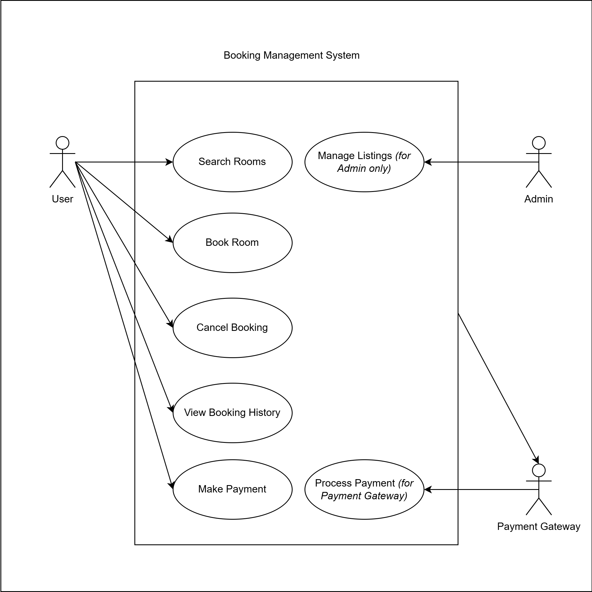

# Requirement Analysis in Software Development

## Introduction

This repository is dedicated to documenting and analyzing the software requirements for a Booking Management System as part of the Requirement Analysis Project. The goal is to simulate a real-world development scenario by applying structured methodologies and tools to craft a comprehensive blueprint for the requirement analysis phase.

Through this project, we aim to enhance our understanding of the Software Development Life Cycle (SDLC) by focusing on one of its most critical stages—Requirement Analysis. This includes identifying and categorizing functional and non-functional requirements, developing visual representations using tools like Draw.io, and defining clear acceptance criteria to guide successful project execution.

---

## What is Requirement Analysis?

Requirement Analysis is the process of identifying, documenting, and managing the needs and expectations of stakeholders for a new or modified product. It is a crucial part of the SDLC that helps ensure the delivered software solution meets business goals and user expectations.

It involves detailed research and communication with stakeholders to gather complete, consistent, and testable requirements. This process reduces the risk of project failure due to unclear or missing requirements and forms the foundation for system design, development, and testing phases.

---

## Why is Requirement Analysis Important?

Requirement Analysis is vital for the following reasons:

- **Clarity and Scope Definition:** It ensures all stakeholders have a shared understanding of the system’s goals and boundaries, reducing ambiguities and scope creep.
- **Improved Design and Planning:** Accurate requirements help developers and designers make better architectural decisions and create more robust systems.
- **Cost and Time Efficiency:** By catching misunderstandings early in the project, Requirement Analysis helps prevent costly rework and delays later in the SDLC.

---

## Key Activities in Requirement Analysis

Here are the five core activities involved:

- **Requirement Gathering:** Collecting initial input from stakeholders about what the system should do.
- **Requirement Elicitation:** Engaging stakeholders through interviews, surveys, and brainstorming sessions to uncover hidden and implicit requirements.
- **Requirement Documentation:** Recording requirements in structured formats (e.g., user stories, SRS documents) for reference and tracking.
- **Requirement Analysis and Modeling:** Evaluating and refining requirements; creating models like data flow diagrams or use case diagrams for better understanding.
- **Requirement Validation:** Ensuring the documented requirements align with stakeholder needs and are feasible within scope, time, and budget.

---

## Types of Requirements

### Functional Requirements

These define what the system **should do**. They describe specific behaviors or functions of the system.

**Examples for the Booking Management System:**
- Users should be able to search for available rooms by location and date.
- The system must allow users to book and cancel reservations.
- Admins can add, modify, or delete room listings.

### Non-functional Requirements

These specify **how** the system performs certain operations rather than what it does.

**Examples:**
- The booking system should handle up to 10,000 concurrent users.
- The system should respond to search queries within 2 seconds.
- Data should be encrypted at rest and in transit for security compliance.

Reference Case Study: [System Design Architecture for Hotel Booking Apps](https://medium.com/nerd-for-tech/system-design-architecture-for-hotel-booking-apps-like-airbnb-oyo-6efb4f4dddd7)

---

## Use Case Diagrams

Use Case Diagrams are visual representations of how users (actors) interact with a system. They help in identifying the functional requirements by illustrating use cases and the relationships between actors and system functionalities.

**Benefits:**
- Improve communication between technical and non-technical stakeholders.
- Identify system boundaries and user interactions early.
- Aid in test case creation and project planning.

**Booking Management System – Use Case Diagram:**

---

## Acceptance Criteria

Acceptance Criteria are predefined conditions that a software product must satisfy to be accepted by stakeholders or users. They ensure that the final product aligns with business goals and user needs.

**Importance:**
- Sets clear expectations for functionality.
- Defines success metrics for development and testing.
- Prevents scope creep by outlining done-ness.

**Example – Checkout Feature:**

> As a registered user, I want to be able to securely pay for my reservation using multiple payment options, so that I can complete my booking easily.

**Acceptance Criteria:**
- Users must be able to view a summary of their reservation before payment.
- Users must have at least two payment options (e.g., credit card, PayPal).
- Payment process should complete within 10 seconds.
- A confirmation email must be sent upon successful checkout.

---

